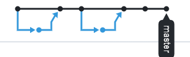

# GitFlow Demo App

## ## What the application does
This project demonstrates GitFlow branching strategy, semantic versioning,
and basic project documentation practices using GitHub

## Developer
Milena Shchedrina

## Documentation
- [Installation guide](INSTALL.md)
- [Changelog](CHANGELOG.md)

## Branching model
The project follows GitFlow branching strategy.

## Network Graph

<!-- demo network branch -->
